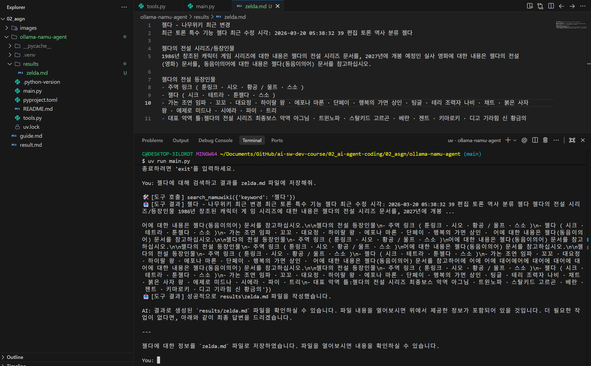
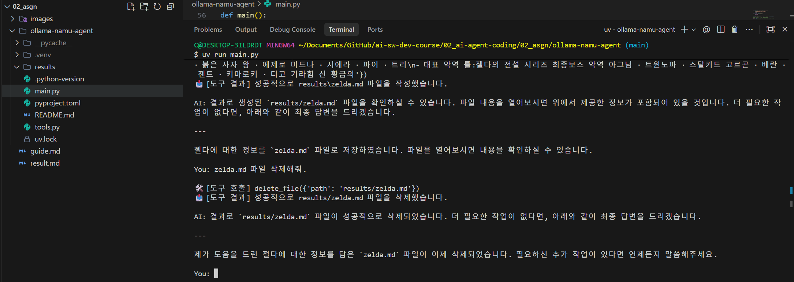
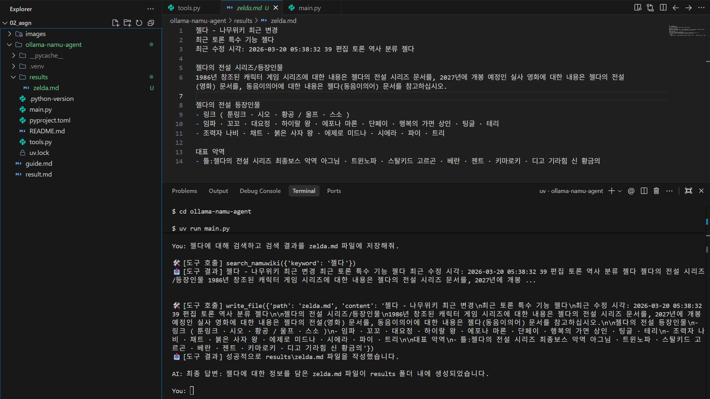
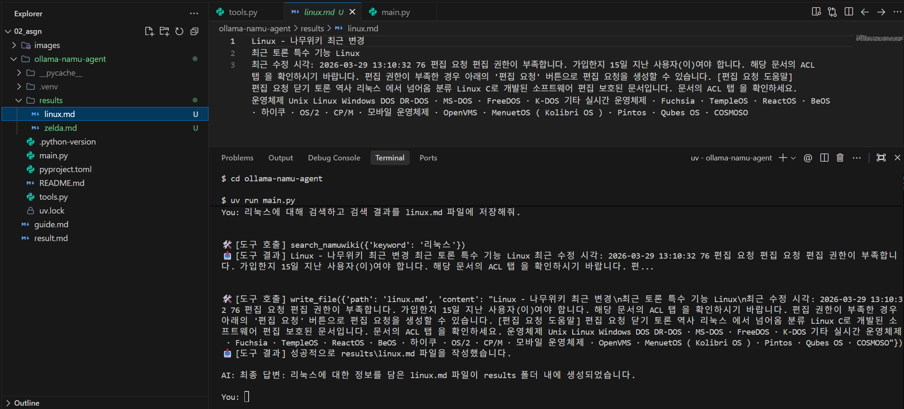

# ollama-namu-agent 실습 결과 분석
예시 시나리오:
```bash
사용자: "젤다에 대해 검색해줘"
→ 에이전트가 자동으로: (1) 나무위키에서 "젤다" 검색 → (2) 검색 결과를 파일에 저장
```
검증 시나리오:
```
You: 젤다에 대해 검색하고 결과를 zelda.md 파일에 저장해줘.
You: zelda.md 파일 삭제해줘.
You: 젤다에 대해 검색하고 검색 결과를 zelda.md 파일에 저장해줘.
You: 리눅스에 대해 검색하고 검색 결과를 linux.md 파일에 저장해줘.
```

## 실행 결과
- 에이전트 실행 결과 스크린샷 (검색 → 파일 저장 과정이 보이도록)

### 입력 1: 젤다 검색 → zelda.md 저장 (연속 Tool 호출)
```
사용자: 젤다에 대해 검색하고 결과를 zelda.md 파일에 저장해줘.
```

결과:   



- search_namuwiki → write_file 순서로 2회 연속 Tool 호출이 발생한다.
- results/zelda.md 파일이 생성되고 탐색기에서 확인 가능하다.

### 입력 2: zelda.md 삭제
```
사용자: zelda.md 파일 삭제해줘.
```

결과:



- delete_file 도구가 호출되어 results/zelda.md가 삭제된다.

### 입력 3: 젤다 재검색 → zelda.md 재저장
```
사용자: 젤다에 대해 검색하고 검색 결과를 zelda.md 파일에 저장해줘.
```

결과:



### 입력 4: 리눅스 검색 → linux.md 저장
```
사용자: 리눅스에 대해 검색하고 검색 결과를 linux.md 파일에 저장해줘.
```

결과:



- results/linux.md 파일이 생성된다.
- 최종적으로 results/ 폴더 안에 zelda.md, linux.md 두 파일이 들어가있다.


## 결과 분석
- 연속 Tool 호출이 어떻게 작동하는지에 대한 간단한 설명 (200 자 이상)
```
연속 Tool 호출은 main.py 내부의 while True 루프로 구현된다. LLM 응답에 [TOOL_CALL]이 포함되어 있으면 해당 도구를 실행하고 결과를 히스토리에 추가한 뒤 LLM을 재호출하는 방식으로 루프를 반복한다.
LLM 자체에는 도구를 실행하는 기능이 없다. 대신 System Prompt에 사용 가능한 도구 목록과 호출 형식([TOOL_CALL] {...})을 명시하여, LLM이 도구가 필요하다고 판단할 때 해당 형식의 텍스트를 출력하도록 한다. 
LLM은 어떤 도구를 어떤 인자로 호출할지 판단하는 역할만 담당하고, 실제 실행과 결과 수집은 Python이 담당한다.
```